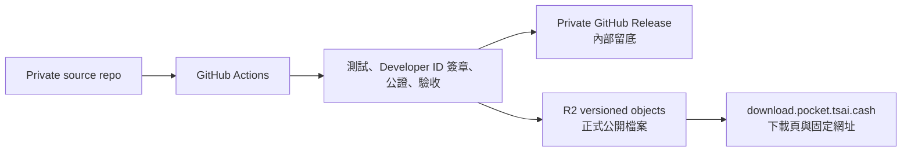

# Pocket 公開下載通路方案

> 2026-07-23 定稿 · **2026-08-18 更新：前提已改變，本方案暫時降為「之後再說」。**
>
> 寫這份文件時 `cashtsai/pocket-connect` 還是 private，所以「怎麼在不公開原始碼的
> 前提下給一般人下載」是個真問題。**現在 repo 已經是公開 + Apache 2.0**
> （見 `LICENSE` / `PATENTS.md`），GitHub Releases 本身就是一條可用的公開下載通路：
> 任何人都能下載 `v0.2` 的已簽章、已公證 `.dmg`，不需要 R2、不需要 release-only repo、
> 不需要跨 repo 的 GitHub App 憑證。
>
> **所以現在的正式下載通路 = GitHub Releases。**
> <https://github.com/cashtsai/pocket-connect/releases>
>
> 下面 R2 + `download.pocket.tsai.cash` 的方案**沒有作廢，但也還沒開工**。真正會讓它
> 值得做的理由剩下三個：品牌網址、下載頁（版本/大小/SHA-256/安裝說明）、
> 以及 GitHub 擋不住的地區性連線問題。在那之前不要為了做而做——每多一條發布路徑，
> 就多一組憑證與一個版本漂移面。
>
> 手機端：Pocket iOS 1.0.0（build 148）審核中，上架後連結為
> <https://apps.apple.com/app/id6787644476>。

---

## 1. 決策

採用 **Cloudflare R2 + `download.pocket.tsai.cash` 自訂網域**作為正式公開下載源，
再以獨立靜態下載頁呈現版本、檔案大小、SHA-256 與安裝說明。

GitHub Release 是目前的正式通路，也同時是建置紀錄。若日後真的加上 R2，每次發行只建置
一次，GitHub Release 與 R2 必須發布同一份 DMG，SHA-256 必須完全相同。

> 2026-08-18 註：這一節原本的立論是「不想公開原始碼所以要另找下載站」。原始碼已經
> 公開（Apache 2.0），這個立論不再成立，下表的判定請照上面的更新說明讀。

---

## 2. Repo 與下載站比較

| 方案 | 優點 | 代價 / 風險 | 判定 |
|---|---|---|---|
| 公開 release-only GitHub repo | 最快上線、Release notes 與版本管理現成、可用固定 latest asset URL | 會多一個外部可見 repo；容易被誤認為 source repo；private source workflow 不能用內建 `GITHUB_TOKEN` 跨 repo 發布，需 GitHub App 或 PAT | 可當短期備案 |
| R2 + 自訂網域 | 不碰 source 可見性、品牌網址、可接 Cache/WAF/Analytics、網路 egress 免費 | 初次需建立 bucket、API token、DNS 與下載頁 | **正式方案** |
| 公開 repo + R2 雙公開源 | 有鏡像與 GitHub 生態 | 多一套憑證與同步失敗面；需處理兩邊版本漂移 | 暫不需要 |

GitHub Actions 的內建 `GITHUB_TOKEN` 權限只涵蓋執行 workflow 的 repository；若採
release-only repo，跨 repo 發布應優先使用只安裝在目標 repo、只有 Contents write
權限的 GitHub App，而不是長效個人 PAT。

參考：

- [GitHub Actions `GITHUB_TOKEN`](https://docs.github.com/en/actions/concepts/security/github_token)
- [在 Actions 使用 GitHub App](https://docs.github.com/en/apps/creating-github-apps/authenticating-with-a-github-app/making-authenticated-api-requests-with-a-github-app-in-a-github-actions-workflow)
- [GitHub Release 固定 latest asset URL](https://docs.github.com/en/repositories/releasing-projects-on-github/linking-to-releases)
- [Cloudflare R2 公開 bucket 與自訂網域](https://developers.cloudflare.com/r2/buckets/public-buckets/)
- [Cloudflare R2 定價](https://developers.cloudflare.com/r2/pricing/)

---

## 3. 發布架構



R2 bucket 建議名稱：`pocket-public-releases`。

公開物件路徑：

```text
/releases/v0.2/Pocket-0.2.dmg
/releases/v0.2/Pocket-0.2.dmg.sha256
/releases/v0.2/manifest.json

/latest/Pocket.dmg
/latest/Pocket.dmg.sha256
/latest/manifest.json
```

版本路徑一旦發布不得覆寫。`latest` 只在版本物件上傳並完成遠端驗證後更新；發行失敗時，
使用者仍會取得上一個完整版本。

Cache policy：

| 路徑 | `Cache-Control` |
|---|---|
| `/releases/*` | `public, max-age=31536000, immutable` |
| `/latest/Pocket.dmg*` | `public, max-age=300` |
| `/latest/manifest.json` | `public, max-age=60` |

---

## 4. Manifest

CI 由 tag、`Info.plist` 與實際產物生成 manifest，不手動填寫：

```json
{
  "schema_version": 1,
  "version": "0.2",
  "tag": "v0.2",
  "published_at": "2026-07-23T00:00:00Z",
  "architecture": ["arm64"],
  "minimum_macos": "<from Info.plist>",
  "filename": "Pocket-0.2.dmg",
  "size_bytes": 23527954,
  "sha256": "751375a494fb74c04acc586b291601397b74e93d54be7a5d5f17c382f0f85c0a",
  "notarization": "stapled",
  "download_url": "https://download.pocket.tsai.cash/releases/v0.2/Pocket-0.2.dmg"
}
```

下載頁只讀取 `latest/manifest.json` 顯示資料，下載按鈕直接連到 manifest 的 versioned
URL，避免頁面與實際版本不一致。

---

## 5. GitHub Actions 施工項目

保留目前 `.github/workflows/release.yml` 的測試、簽章、公證、staple、Gatekeeper
驗收與 private GitHub Release。其後新增以下步驟：

1. 由已驗收的 DMG 生成 SHA-256 與 manifest。
2. 檢查 versioned R2 object；若同路徑已存在但 metadata hash 不同，立即失敗，不覆寫。
3. 上傳 versioned DMG、checksum 與 manifest，附上 `sha256` metadata。
4. 從公開 HTTPS URL 回下載一次，重新計算 SHA-256。
5. 驗證成功後才更新三個 `/latest/` objects。
6. 對固定下載網址做 HTTP、檔案大小與 checksum smoke test。

需要新增的 private repo Actions 設定：

| 類型 | 名稱 | 用途 |
|---|---|---|
| Secret | `R2_ACCESS_KEY_ID` | bucket-scoped S3 credential |
| Secret | `R2_SECRET_ACCESS_KEY` | bucket-scoped S3 credential |
| Variable | `R2_ACCOUNT_ID` | 組成 R2 S3 endpoint |
| Variable | `R2_BUCKET` | `pocket-public-releases` |
| Variable | `R2_PUBLIC_BASE_URL` | `https://download.pocket.tsai.cash` |

R2 credential 僅授權該 bucket 的 object read/write，不給 Cloudflare 帳號、DNS 或其他
bucket 權限。Developer ID、notary 與 Sign in with Apple secrets 不得放入下載站、
R2 metadata 或公開 repo。

---

## 6. 下載頁

下載頁第一版只需要：

- Pocket 名稱與目前版本
- Apple Silicon / macOS 相容資訊
- DMG 大小、SHA-256、Developer ID 簽章與 Apple 公證狀態
- 主下載按鈕
- 簡短安裝步驟與 release notes 連結
- 支援與隱私政策連結

頁面程式碼可維持 private；是否公開 Pocket 應用程式原始碼不受影響。下載頁不處理
Apple 登入，也不共用 `pocket.tsai.cash` auth broker 的 runtime secrets。

---

## 7. 回滾

1. 找出上一版 versioned objects 並重新驗證 SHA-256。
2. 將 `/latest/` 三個 objects 指回上一版內容。
3. 下載頁從新的 `latest/manifest.json` 自動回到上一版。
4. 保留故障版本的 immutable objects 與 private GitHub Release 供追查；不要就地覆寫。
5. 修復後用新 tag 發布，不重用已發布 tag。

---

## 8. 上線前確認

> 2026-08-18：以下都是「日後真的要做 R2 通路」時才需要的。目前 GitHub Releases
> 已可對外，這張表整份處於**未開工**狀態，不是阻塞項。

- [ ] 確認正式 hostname 為 `download.pocket.tsai.cash`
- [ ] 建立 private R2 bucket `pocket-public-releases`
- [ ] 建立 bucket-scoped R2 credential
- [ ] 綁定 custom domain；不要用僅供開發用途的 `r2.dev`
- [ ] 將 R2 secrets / variables 加入 private source repo
- [ ] 擴充 release workflow 並用新測試 tag 驗證
- [ ] 建立下載頁，確認 mobile / desktop、下載連結與 checksum
- [ ] 以一台未參與開發的 Mac 做首次下載、安裝與啟動驗收

在以上項目完成前，**公開的 GitHub Release 就是正式通路兼留底**。無論如何，簽章材料
（Developer ID `.p12`、notary API key、Sign in with Apple `.p8`）都不得進 repo、
不得放進 DMG、不得放進下載站或 R2 metadata。
